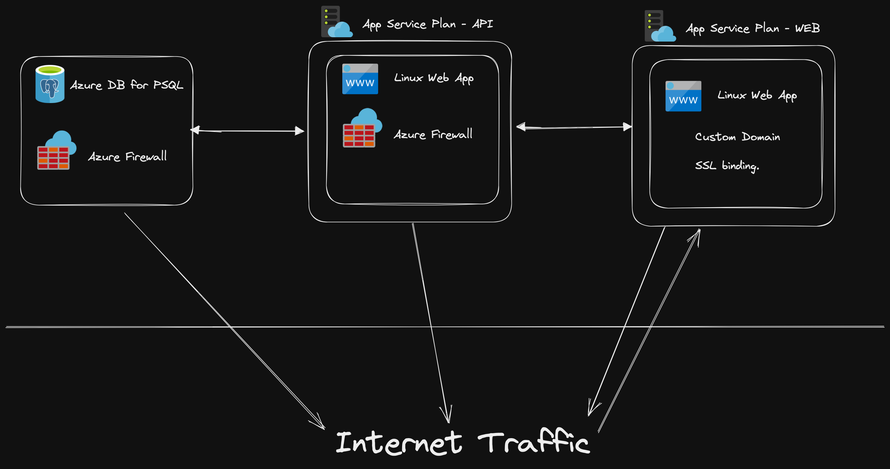
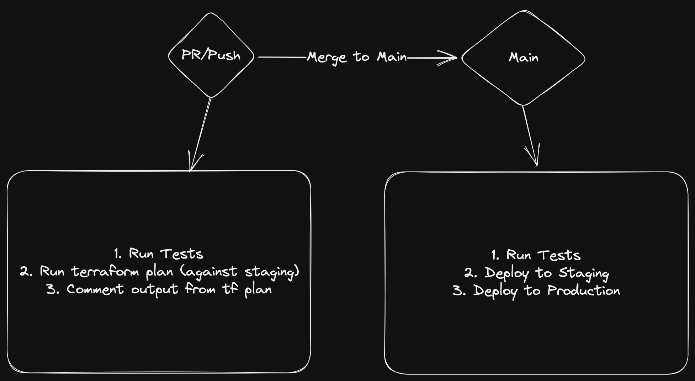

# Full-stack starter kit for Next.js, Nest.js, Prisma and Azure.

This is a starter kit for building full-stack application and deploying to Azure. Infrastructure code is managed with Terraform. It is based on the following technologies:
## Database
- [Azure Database for PostgreSQL](https://azure.microsoft.com/en-us/services/postgresql/)
## Backend
- [Nest.js](https://nestjs.com/)
- [Prisma](https://www.prisma.io/)
- [PostgreSQL](https://www.postgresql.org/)
- [Swagger](https://swagger.io/)
- [TypeScript](https://www.typescriptlang.org/)
- [Azure Web App](https://azure.microsoft.com/en-us/services/app-service/web/)

The stack has a Nestjs backend with Prisma ORM and PostgreSQL database. This is so that you can easily switch to any other database supported by Prisma. I'm not using nextjs backend as I like to keep things separate. There are a couple of examples for NestJs modules and controllers included in the repo. You can remove/repurpose them as you see fit.

Environment variables needed for backend:
* `DATABASE_URL` - connection string for the database
* `PORT` - port for the backend to listen on (defaults to 4000)

Scripts:
* `yarn dev` - starts the backend in development mode
* `yarn build` - builds the backend for production
* `yarn start` - starts the backend in production mode (this is using pm2 to run the app so there's no extra typescript compilation overhead)
* `yarn prisma:generate` - generates prisma client
* `yarn seed` - seeds the database with some data
## Frontend
- [Next.js](https://nextjs.org/)
- [Chakra UI](https://chakra-ui.com/)
- [TypeScript](https://www.typescriptlang.org/)
- [Azure web app](https://azure.microsoft.com/en-us/services/app-service/web/)

Frontend is a Next.js app with Chakra UI. There's a sample page with server-side rendering where data is fetched from the backend.
## Infrastructure
- [Terraform](https://www.terraform.io/)
- [Azurerm](https://www.terraform.io/docs/providers/azurerm/index.html)

Infrastructure is managed with Terraform. It creates the following resources:
* Azure Database for PostgreSQL (with firewall rules to allow access from the backend ONLY)
* Azure Web App for backend (with connection string to the database, environment variables and firewall rules to allow access from the frontend ONLY)
* Azure Web App for frontend (with environment variables for backend url)

Below is a diagram of the infrastructure:


## CI/CD
Environment variables needed for infrastructure:
* `ARM_CLIENT_ID` - Azure client id
* `ARM_CLIENT_SECRET` - Azure client secret
* `ARM_SUBSCRIPTION_ID` - Azure subscription id
* `ARM_TENANT_ID` - Azure tenant id
* `AZURE_CREDENTIALS` - Azure credentials in json format.
These can be obtained with the following command in azure cli:
```
az ad sp create-for-rbac --name {NAME} \
                         --role Contributor \
                         --scopes /subscriptions/{SUBSCRIPTION ID}/resourceGroups/{RG NAME} --sdk-auth
```
The output of this command goes into `AZURE_CREDENTIALS` as a whole. The JSON will also contain the `ARM_CLIENT_ID`, `ARM_CLIENT_SECRET`, `ARM_SUBSCRIPTION_ID` and `ARM_TENANT_ID` values.
* `PSQL_PASSWORD` - password for the database
* `PSQL_USERNAME` - username for the database

Below is a diagram of the CI/CD pipeline:


To break it down:
* `branch.yaml` - runs on every push to a branch. It runs the tests and runs terraform plan against staging environment. This will also comment the output from terraform plan on the pull request so that you can see what changes will be applied.
* `deploy.yaml` - this is triggered via `workflow_call` from `multi_stage_deploy.yaml`. It runs terraform apply against the environment specified in the `environment` parameter. It also builds and deploys the frontend and backend (concurrently so it doesn't take as much time). Best practice would be to deploy web after backend is deployed but I'm not doing that here.
* `multi_stage_deploy.yaml` - this is triggered on every push to `main` branch. It runs the tests and then runs `deploy.yaml` twice - once for staging and once for production. 
* `lint_and_test.yaml` - runs the linter and tests. Called from `branch.yaml` and `multi_stage_deploy.yaml`.

Example of CI/CD pipeline in action:
1. Push to branch and create PR:
   - Tests and linter run
   - Terraform plan is run against staging environment
2. Branch merged to main:
   - Tests and linter run
   - Terraform plan is run against staging environment
   - Terraform apply is run against staging environment
   - Frontend and backend are deployed to staging environment
   - **Manual approval is required to deploy to production** (see github environment protection rules)
   - Terraform plan is run against production environment
   - Terraform apply is run against production environment
   - Frontend and backend are deployed to production environment

## Local development
To run the app locally you need to have the following installed:
* [Docker](https://www.docker.com/)

To run the app locally you need to run the following commands:
- install dependencies for api and web
- run `docker-compose up -d` to start the database, backend and frontend containers

Once the containers are up and running you can access the frontend at `http://localhost:3000` and the backend at `http://localhost:4000`.


